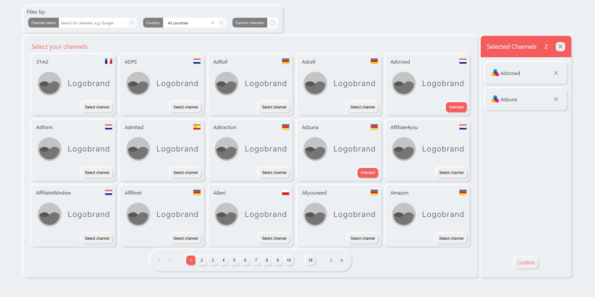

# Channable Assignment

## Install

```
yarn install
yarn add @stitches/react

```

## Run

```
yarn run start
```

---

## Features

- Added message that warns the user if no matches are found.

- Added a custom search parameter to filter all the custom channels.

- Active filters have highlighted UI.

- Pagination shows the last page number to help the user identify the amount of browsable pages

- Divided the pagination results pages in sets. Every sets has 10 pages and it's possible to navigate to the previous/next page (-/+ 1) and by sets (-/+ 10).

- DEBOUNCE function to limit the search rate to improve computing performance (and database calls if remote) instead of the "Submit" search button.

- Selected channels are previewed in the side pane to facilitate their removal and to help to doublecheck their channels selection.

---

## Possible further development

- **Favourite channels selection feature**. Clickable star icon to add the channel to the favourites. Favourite channels are displayed first in the list _(ignoring alphabetic sorting)_
- **Loading icon during input typing** in the search term filter (or API call if remote), returning an error if the loading times out or fails

## Assignment preview


## Assignment end result


